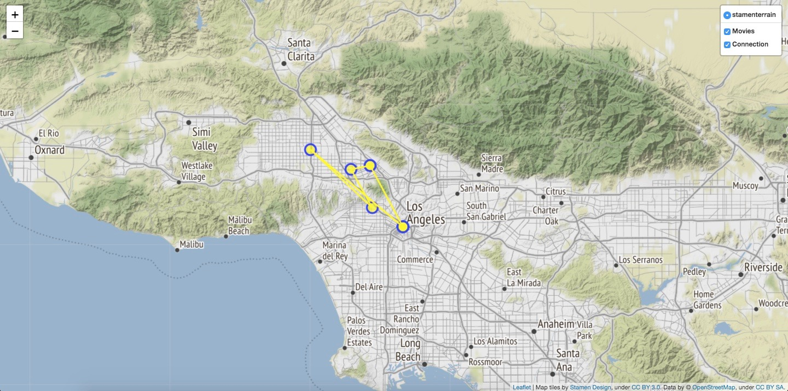
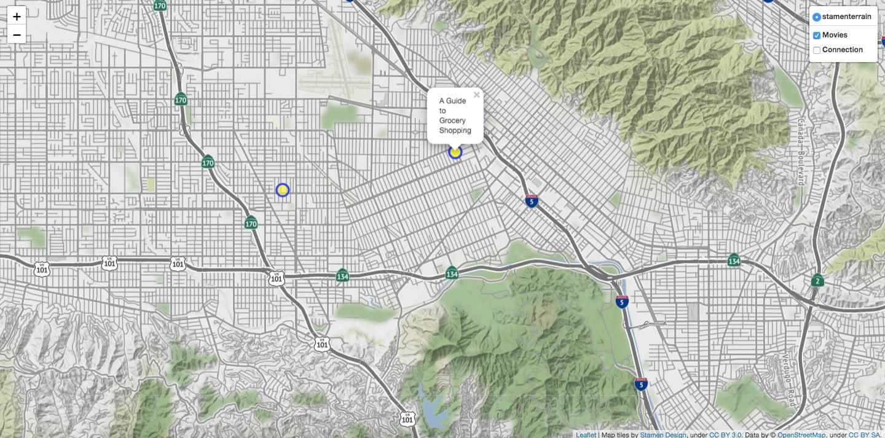

# web_map

Користувач вказує для фільмів якого року він
 бажає побудувати карту та свою локацію 
 як широту (latitude) та довготу (longitude) (e.g. 49.83826,24.02324), 
 і як результат отримує HTML файл. На веб-карті зображуються мітки 
 до 10 найближчих місць зйомок фільмів. Міткам відповідають назви
 цих фільмів. На третьому шарі мапи відбувається віртуальне 
 поєднання цих міток. 


### Передумови

Необхідно встановити бібліотеки folium, pandas та geopy. 
```
pip install folium
```
```
pip install pandas
```
```
pip install geopy
```


### Структура html файлу
Файл складається з трьох секцій: head, body i script.
При створенні мапи використовуються тег <style>, пов'язаний з 
каскадними таблицями стилів, а також тег <script> для JavaScript,
тег <link> для встановлення зв'язку з зовнішніми документами, etc.


### Приклад запуску введення та скріншот згенерованої мапи
```
Please enter a year you would like to have a map for: 2017
Please enter your location (format: lat, long): 34.0928, -118.3287
Map is generating...
Please wait...
Finished. Please have look on the map Map.html
```





### Висновок
Ця карта дає надає інформацію щодо розміщення
місць зйомок фільмів та їх назви відповідно до року та вашої 
локації. Також віртуальне поєднання точок зображує 
відстані між цими локаціями.


## Автори

* **Дар'я Омелькіна**
